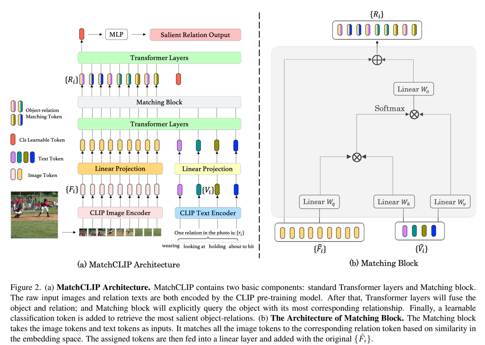

# CE7454 PSG Classification Task

In this project, I explore the PSG classification task and view it as a object-relation matching problem. According to this intuition, I build the MatchCLIP based on CLIP and ViT to adapt the PSG problem. I use CLIP as a pre-training model to extract both image and text features, and due to explicitly encode the relation, it can query the relationship between different objects automatically. It achieves 34.60\% mean recall@3 on the PSG classification competition leaderboard. 

